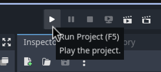

# Directional audio processing and visualization on the GPU

## Project organization
The project is divided into two components:
-  The audio processing itself, powered by Vulkan, which lives in the `audio-processor` directory
-  The Godot visualization and glue-code which lives in the `visualizer` directory

Additionally, the `approx_dbscan_rs` git submodule is included as it is a modified fork of a Rust implementation of the Approximate DBSCAN clustering algorithm, and is used by the audio processor.

## Getting started
> [!IMPORTANT]
> When cloning this repository, make sure to use `git clone --recurse-submodules <repo_url>` to include the necessary submodules

### 1. Installing dependencies
This project depends on the following software:
- [Rust programming language](https://www.rust-lang.org/)
- [Godot game engine](https://godotengine.org/)
- [Vulkan SDK](https://www.lunarg.com/vulkan-sdk/)

### 2. Building 
As most of the project is written in Rust, `cargo` tool, built into the rust toolchain, is used to build it.

```bash
cd ./visualizer/rust-interface
cargo build
```

If some shader-related compilation error is displayed, make sure the Vulkan SDK, which includes a glsl compiler, is installed.

### 3. Running
The `./visualizer` can now be opened directly in Godot by:
1. Opening Godot
2. Clicking `Import` on the top left corner
3. Selecting `./visualizer/project.godot`

To run the project, this button can then be clicked on the top right corner:


